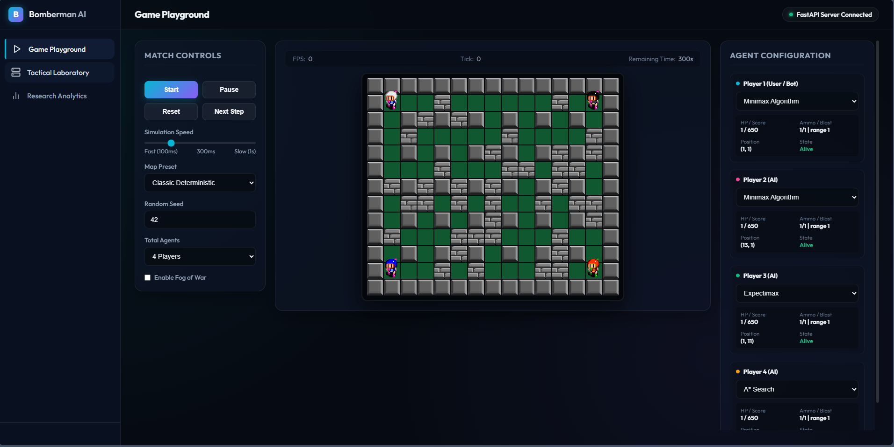
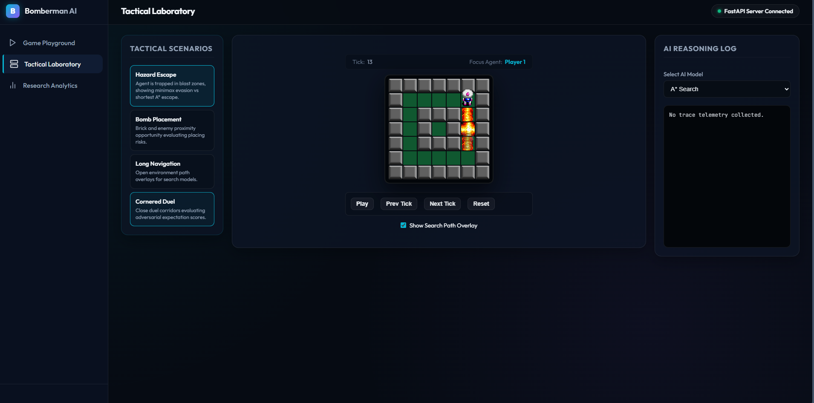
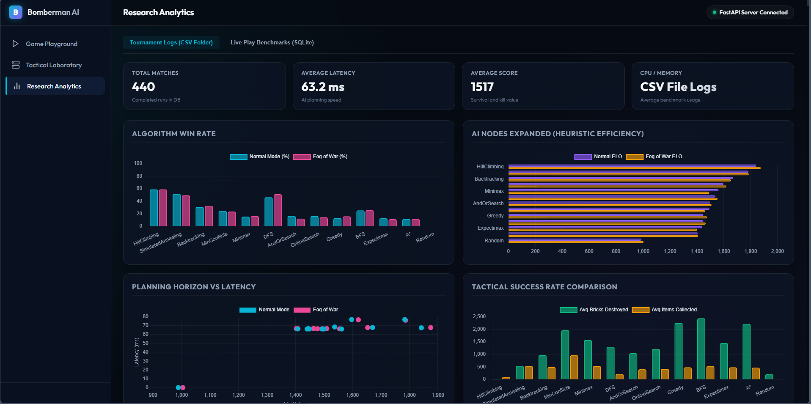
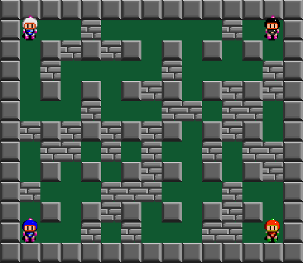
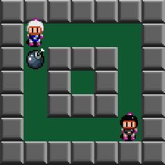
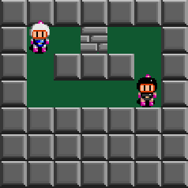
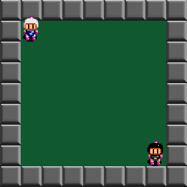
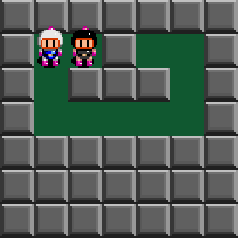
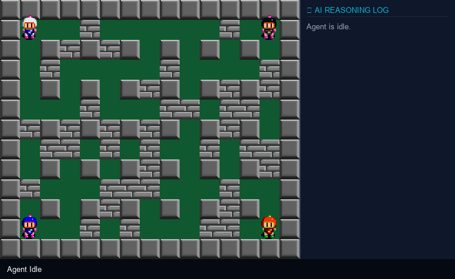
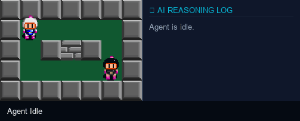

# 💣 BombermanAI — Multi-Agent AI Research Platform

> A Python-based Bomberman simulation platform for researching and benchmarking AI agent algorithms, featuring a real-time web visualization frontend and a FastAPI backend.


---

## 🖥️ Web UI Dashboard & Modules

Here are the screenshots of the three main application modules designed for the platform, showcasing the simulation configuration, CSP map generation, and the real-time tournament analytics dashboard:

### 🎮 Module 1: AI Agent Simulation & Playground
* Configures live play benchmarks, runs simulated ticks, and monitors path planning / utility evaluations for search agents.


### 🗺️ Module 2: Procedural Map Generation (CSP)
* Procedurally builds fully solvable, symmetric game grids with customized wall density, brick ratios, and spawn positions governed by constraint satisfaction solvers.


### 📊 Module 3: Tournament Analytics Dashboard
* Visualizes win rates, ELO ratings, agent survival steps, items collected, and average latencies across all 13 algorithms using interactive graphs.


---

## 🎮 Visual Demonstrations (Animated GIFs)

Below are live gameplay and tactical scenario simulations generated using the actual game engine and original pixel-art assets:

### 1. ⚔️ Standard 4-Player Match
* **Agents**: Player 1 (Minimax), Player 2 (A*), Player 3 (Expectimax), Player 4 (Greedy).
* **Behavior**: Watch all 4 search agents actively navigating, clearing bricks, collecting items, and trapping each other with bombs.


### 2. 🏃‍♂️ Scenario 1: Hazard Escape (A* Search)
* **Goal**: Player 1 (A*) detects a bomb placed next to it, calculates the explosion coverage, and escapes to safety behind a wall.


### 3. 💣 Scenario 2: Bomb Placement (Greedy Search)
* **Goal**: Player 1 (Greedy) navigates to the nearest brick walls and places bombs to destroy obstacles.


### 4. 🧭 Scenario 3: Long Navigation (BFS Search)
* **Goal**: Player 1 (BFS) finds the shortest path through a large open map to reach the target opponent.


### 5. 🥊 Scenario 4: Corner Duel (Minimax vs Minimax)
* **Goal**: Two close-range agents lock in a tight corridor, evaluating actions using minimax search.

---

## 🧠 How the AI Thinks (Search Visualization)

To research and benchmark the multi-agent AI, the platform provides search overlays displaying how each algorithm makes decisions in real-time. Below are visual demos of three algorithms from different search groups (Informed, Uninformed, and Adversarial):

### 1. 🔍 A* Search (Informed Search Group)
* **Visual Overlay**: The **light-blue overlay** indicates the computed optimal path to the target.
* **Thinking Process**: Evaluating heuristics (Manhattan distance to targets and safety cells), expanding nodes efficiently toward the goal.
* **Telemetry Bar**: Displays expanded nodes, current frontier size, depth, and best chosen action.


### 2. 🌀 DFS Search (Uninformed Search Group)
* **Visual Overlay**: The **light-blue overlay** shows deep, winding path explorations.
* **Thinking Process**: Expands nodes down a single branch without a heuristic guidance, resulting in long non-optimal path predictions.
* **Telemetry Bar**: Shows depth and total nodes expanded.


### 3. ⚔️ Minimax Search with Alpha-Beta Pruning (Adversarial Search Group)
* **Visual Overlay**: The **numbers overlayed on cells** show the computed minimax utility values for candidate directions.
  * 🟢 **Green numbers** (positive values) represent safe, rewarding tiles.
  * 🔴 **Red numbers** (negative values) represent hazard zones or death traps (e.g. from nearby bombs).
* **Thinking Process**: Simulating adversarial moves of the nearest enemy to minimize the player's risk while maximizing their reward.


---

## 👥 Authors

| Name | Student ID |
|---|---|
| Phạm Quốc Huy | 24110226 |
| Phan Tiến Đạt | 24110195 |

> **Course**: Introduction to Artificial Intelligence  
> **University**: University of Technology and Engineering ( UTE )

---

## 📖 Overview

BombermanAI is an **Environment-Agent research platform** inspired by the OpenAI Gym design philosophy. It cleanly separates the game simulation (Environment) from the decision-making layer (Agent), allowing researchers to plug in and compare different AI algorithms — from simple heuristics to adversarial search trees and CSP-based map generation.

**Key highlights:**
- 🎮 Full Bomberman physics: bombs, explosions, chain-reactions, items, enemies
- 🤖 Multiple AI agents: **Minimax**, **Expectimax**, **Random**
- 🗺️ Procedural map generation using **Constraint Satisfaction Problems (CSP)**
- 📊 Real-time stats tracked in **SQLite** and served via REST API
- 🌐 **Web-based frontend** visualization playable in any browser
- 🧪 Automated **benchmarking** with Win Rate, Survival Time, Score metrics

---

## 🏗️ Architecture

The project follows a strict **Environment ↔ Agent separation**:

```
┌─────────────────────────────────────┐
│             Environment             │
│                                     │
│  Map · Bombs · Explosions · Items   │
│  Enemies · Physics · Score          │
└─────────────┬───────────────────────┘
              │  state (Observation)
              ▼
┌─────────────────────────────────────┐
│               Agent                 │
│                                     │
│  choose_action(state) → action      │
│  Minimax / Expectimax / Random      │
└─────────────┬───────────────────────┘
              │  action (Decision)
              ▼
         Environment.step()
```

The **Backend (FastAPI)** bridges the web frontend and the Python simulation engine, while the **Frontend** provides a real-time browser-based game view.

```
Browser (frontend/)
     │  HTTP / Fetch API
     ▼
FastAPI Server (backend/app/)
     │  Python calls
     ▼
SimulationEngine + AI Agents
     │  SQLite writes
     ▼
Database (database/bomberman.db)
```

---

## 📁 Project Structure

```
BombermanAI/
│
├── agents/                      # AI Agent implementations
│   ├── __init__.py              # BaseAgent abstract interface
│   ├── random_agent.py          # RandomAgent — moves randomly
│   ├── minimax_agent.py         # MinimaxAgent — adversarial search (depth-2)
│   └── expectimax_agent.py      # ExpectimaxAgent — probabilistic search
│
├── environment/                 # Core game simulation
│   ├── __init__.py              # Exports Environment class
│   ├── env.py                   # Main Environment orchestrator
│   ├── map.py                   # Map initialization, walls, connectivity checks
│   ├── player.py                # Player state (position, HP, ammo, blast radius)
│   ├── enemy.py                 # Enemy state and movement AI
│   ├── bomb.py                  # Bomb lifecycle and countdown
│   ├── explosion.py             # Explosion propagation and chain reactions
│   ├── item.py                  # Collectible power-up items
│   └── map_generators/          # CSP-based procedural map generation
│       ├── __init__.py
│       ├── backtracking_csp.py  # Backtracking CSP solver
│       ├── hybrid_csp.py        # Hybrid CSP (backtracking + min-conflicts)
│       ├── min_conflict_csp.py  # Min-Conflicts CSP solver
│       └── map_quality_evaluator.py  # Map quality metrics
│
├── backend/                     # FastAPI REST server
│   ├── app/
│   │   ├── __init__.py
│   │   ├── main.py              # FastAPI app, routes, CORS, startup
│   │   ├── engine.py            # SimulationEngine (game loop)
│   │   ├── models.py            # Pydantic / dataclass models
│   │   ├── map_generator.py     # Map generation integration
│   │   ├── database.py          # SQLite connection and queries
│   │   └── metrics_tracker.py   # Per-match statistics tracker
│   └── tests/                   # Unit tests for backend
│       ├── test_engine.py
│       ├── test_database.py
│       └── test_map_generator.py
│
├── benchmarks/                  # Standalone benchmark runner
│   ├── __init__.py
│   ├── benchmark.py             # Game loop + performance report
│   └── map_gen_benchmark.py     # CSP map generation benchmark
│
├── metrics/                     # Metrics collection module
│   ├── __init__.py
│   └── metrics.py               # Win Rate, Score, Steps tracker
│
├── configs/                     # Game configuration
│   └── default_config.py        # Grid size, brick density, timers
│
├── database/                    # Persistent storage
│   ├── schema.sql               # SQLite schema (matches, agent_match_stats)
│   └── bomberman.db             # SQLite database file
│
├── frontend/                    # Web visualization client
│   ├── index.html               # Single-page Bomberman UI
│   ├── app.js                   # Game loop, rendering, keyboard input
│   └── assets/                  # Sprite images (PNG)
│
├── main.py                      # CLI entry point for benchmark runs
├── requirements.txt             # Python dependencies
├── .gitignore
└── README.md
```

---

## 🔧 Tech Stack

| Layer | Technology |
|---|---|
| AI / Simulation | Python 3.12, NumPy |
| Backend API | FastAPI, Uvicorn, Pydantic |
| Database | SQLite3 |
| Frontend | Vanilla HTML5 / CSS3 / JavaScript |
| Testing | Pytest |
| Data Analysis | Pandas |

---

## 🤖 AI Algorithms

### 1. MinimaxAgent (`agents/minimax_agent.py`)
Implements **depth-2 Minimax search** with:
- Heuristic evaluation function (safety, enemy proximity, items, brick count)
- BFS-based escape path checking to avoid getting trapped by bombs
- Chain-reaction bomb simulation
- Early pruning of clearly losing branches

### 2. ExpectimaxAgent (`agents/expectimax_agent.py`)
Implements **Expectimax** to handle stochastic opponents:
- Same heuristic evaluation framework as Minimax
- Models enemy moves as a probability distribution rather than adversarial
- Better suited for games with non-optimal or random opponents

### 3. RandomAgent (`agents/random_agent.py`)
Baseline agent that samples uniformly from all legal actions. Useful as a benchmark baseline.

### 4. CSP Map Generation (`environment/map_generators/`)
Three CSP approaches for generating valid, playable maps:
- **Backtracking CSP** — complete but slower, guarantees constraint satisfaction
- **Min-Conflicts CSP** — fast local search, good for large maps
- **Hybrid CSP** — combines both for quality + speed balance

---

## 🕹️ State & Action Space

### Action Space
At each step, an agent selects **one of 6 actions**:

| Action | Description |
|---|---|
| `UP` | Move one cell upward |
| `DOWN` | Move one cell downward |
| `LEFT` | Move one cell to the left |
| `RIGHT` | Move one cell to the right |
| `BOMB` | Place a bomb at current position |
| `WAIT` | Stay in place (no-op) |

### State Representation
The `choose_action(state)` method receives a Python `dict`:

```python
state = {
    "self_position":    (x, y),                  # Agent's current position
    "enemy_positions":  [(x, y), ...],            # Positions of living enemies
    "bomb_positions":   [(x, y, timer), ...],     # Active bombs with countdown
    "explosions":       [(x, y), ...],            # Tiles currently on fire
    "walls":            [(x, y), ...],            # Indestructible wall tiles
    "bricks":           [(x, y), ...],            # Destructible brick tiles
    "items":            {(x, y): item_type, ...}, # Power-up items on map
    "ammo":             1,                        # Bombs available to place
    "blast_radius":     2,                        # Agent's explosion range
    "width":            15,                       # Map width in tiles
    "height":           13,                       # Map height in tiles
}
```

---

## ⚙️ Installation

### Prerequisites
- Python **3.12+**
- `pip`

### 1. Clone the repository
```bash
git clone https://github.com/<your-username>/Boomber-AI-.git
cd Boomber-AI-
```

### 2. Install dependencies
```bash
pip install -r requirements.txt
```

For the backend server, install additional packages:
```bash
pip install fastapi uvicorn
```

---

## 🚀 Running the Project

### Option A — CLI Benchmark (Python only, no server needed)

Run a quick benchmark of 10 games with MinimaxAgent and get a performance report:

```bash
python main.py
```

**Sample output:**
```
Initializing MinimaxAgent...

Running a sample game with ASCII rendering...
[... ASCII map frames ...]

Starting benchmark of 10 matches...

=== BENCHMARK REPORT (10 Games) ===
Win Rate:              70.00%
Average Score:         142.30
Average Steps:         218.60
Average Survival Time: 218.60 ticks
============================================
```

---

### Option B — Full Stack (FastAPI Backend + Web Frontend)

#### Step 1: Start the backend server

```bash
cd backend
uvicorn app.main:app --reload --host 0.0.0.0 --port 8000
```

The API will be available at `http://localhost:8000`.  
Interactive API docs: `http://localhost:8000/docs`

#### Step 2: Open the frontend

Simply open `frontend/index.html` in your browser (no build step needed):

```bash
# Windows
start frontend/index.html

# macOS / Linux
open frontend/index.html
```

> **Controls**: Arrow keys or WASD to move, `Space` to place a bomb.

---

## 🧪 Running Tests

```bash
cd backend
pytest tests/ -v
```

---

## 📡 API Reference

| Method | Endpoint | Description |
|---|---|---|
| `GET` | `/` | Health check |
| `POST` | `/api/init` | Initialize a new game session |
| `POST` | `/api/step` | Advance game by one step (pass player action) |
| `GET` | `/api/benchmark/db-stats` | Retrieve aggregated match statistics from DB |

### `POST /api/init` — Response example
```json
{
  "status": "initialized",
  "state": { "width": 15, "height": 13, "grid": [...], "agents": {...}, "bombs": [], "step_count": 0 }
}
```

### `POST /api/step` — Request body
```json
{
  "actions": {
    "player_1": 3
  }
}
```
Action codes: `0=STOP`, `1=LEFT`, `2=RIGHT`, `3=UP`, `4=DOWN`, `5=PLACE_BOMB`

### `GET /api/benchmark/db-stats` — Response example
```json
{
  "total_matches": 42,
  "avg_steps": 187.3,
  "leaderboard": [
    {
      "agent_id": "player_1",
      "name": "Minimax Agent",
      "algorithm": "minimax",
      "matches_played": 42,
      "wins": 28,
      "win_rate": 66.67,
      "avg_survival_steps": 201.4,
      "total_kills": 91,
      "avg_latency_ms": 12.5
    }
  ]
}
```

---

## 📊 Benchmark Metrics

The platform tracks the following metrics per match:

| Metric | Description |
|---|---|
| **Win Rate** | Percentage of games won out of total games played |
| **Average Score** | Mean score accumulated across all benchmark games |
| **Average Steps** | Mean number of game steps before the match ends |
| **Survival Time** | Number of steps the agent survived (ticks) |
| **Total Kills** | Number of enemies eliminated |
| **Avg Latency (ms)** | Mean decision time per step for each agent |

---

## 🗺️ Future Work

- [ ] Implement **Deep Q-Network (DQN)** reinforcement learning agent
- [ ] Add **Alpha-Beta pruning** to Minimax for deeper search depth
- [ ] Multi-player tournament mode with leaderboard
- [ ] Add **PPO** (Proximal Policy Optimization) agent
- [ ] Export match replays as JSON for offline analysis

---

## 📄 License

This project is for academic and educational purposes.  
© 2024 Phạm Quốc Huy & Phan Tiến Đạt — UTE
